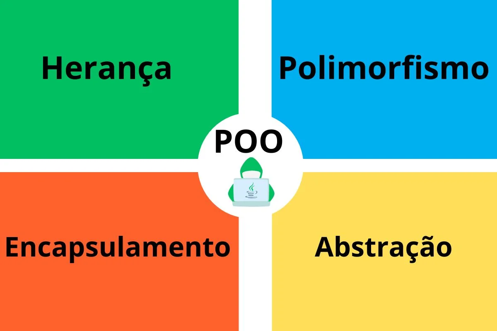

# Atividade 8 - Lista de Exercícios sobre POO

Atividade que visa a prática de Programção Orientada a Objetos e seus Pilares.

## Exercícios

### Encapsulamento:

1. **Criação de uma Classe Simples:**  
   Objetivo: Crie uma classe Produto que represente um produto de uma
   loja. A classe deve ter atributos privados nome, preco e quantidade em
   estoque. Implemente métodos públicos para acessar e modificar esses
   atributos. Garanta que o preço e a quantidade não possam ser negativos.

2. **Melhorando a Classe com Validação:**  
   Objetivo: Extenda a classe Produto para incluir um método
   aplicarDesconto(double porcentagem) que reduz o preço do produto.
   Valide para garantir que o desconto não possa ser maior que 50%.
   Implemente a lógica que lança uma exceção se o desconto for inválido.

### Herança:

3. **Criação de uma Hierarquia de Classes:**  
   Objetivo: Crie uma classe Funcionario com atributos nome e salario. Em
   seguida, crie duas subclasses: Gerente e Desenvolvedor. Adicione um
   método calcularBonus que retorna um valor diferente para cada tipo de
   funcionário (por exemplo, 20% do salário para Gerente e 10% para
   Desenvolvedor). Utilize protected para permitir que as subclasses
   acessem os atributos da classe base de forma segura.
4. **Sobrescrita de Métodos:**  
   Objetivo: Na classe Funcionario, crie um método trabalhar(), que
   imprime uma mensagem genérica sobre o trabalho realizado. Nas
   subclasses Gerente e Desenvolvedor, sobrescreva esse método para
   especificar o tipo de trabalho realizado por cada um. Utilize a anotação
   @Override e explore como ela ajuda a garantir que a sobrescrita foi feita
   corretamente.

### Polimorfismo:

5. **Polimorfismo com Interfaces:**  
   Objetivo: Crie uma interface IMeioTransporte com métodos acelerar() e
   frear(). Implemente essa interface em classes Carro, Bicicleta e Trem.
   No método principal, crie um array de IMeioTransporte e percorra-o
   chamando acelerar() e frear() para cada objeto. Utilize polimorfismo
   para que cada tipo de transporte implemente acelerar() e frear() de
   maneira diferente.
6. **Polimorfismo com Classes Abstratas:**  
   Objetivo: Crie uma classe abstrata Animal com um método abstrato
   emitirSom(). Crie subclasses Cachorro, Gato e Vaca, cada uma
   implementando emitirSom() de maneira específica. Crie uma lista de
   Animal no método principal e adicione instâncias de cada subclasse. Itere
   sobre a lista e invoque o método emitirSom() para cada animal,
   demonstrando o polimorfismo.

### Abstração:

7. **Abstração em um Sistema de Pagamentos:**  
   Objetivo: Crie uma classe abstrata FormaPagamento com métodos
   abstratos processarPagamento(double valor) e validarPagamento().
   Crie classes concretas CartaoCredito, Boleto e Pix que herdam de
   FormaPagamento e implementam os métodos abstratos. Adicione lógica de
   validação específica para cada forma de pagamento e simule um sistema
   que utilize diferentes formas de pagamento.
8. **Sistema de Gestão de Funcionários:**
   Objetivo: Crie um sistema que gerencie diferentes tipos de funcionários
   (Gerente, Desenvolvedor, Estagiario). Cada tipo de funcionário deve ter
   uma maneira diferente de calcular o salário e o bônus. Utilize uma
   combinação de herança, polimorfismo e encapsulamento para estruturar
   as classes. Implemente um método calcularFolhaPagamento que itera
   sobre todos os funcionários e calcula o total de salários e bônus. Adicione
   novas funcionalidades, como a possibilidade de promover um funcionário,
   o que altera seu tipo e os cálculos de salário e bônus. 

---

## Como baixar e executar o projeto

### Clonar o repositório

1. Abra o terminal ou a linha de comando.
2. Execute o comando a seguir para clonar o repositório do GitHub para sua máquina local:

   ```bash
   git clone https://github.com/devlavanere/aulasMaisPraTi.git
3. Navegue até o repositório do projeto

   ```bash
   cd seu repositório

## Como Executar o Projeto Java em Vários Editores

### 1. IntelliJ IDEA
IntelliJ IDEA é um dos IDEs mais populares para desenvolvimento Java. Siga os passos abaixo para executar seu projeto:

#### Passos:
1. Abra o IntelliJ IDEA.
2. Vá até `File > Open` e selecione o diretório do projeto.
3. O IntelliJ vai importar automaticamente o projeto e as dependências.
4. Após a importação, localize o arquivo principal do projeto (por exemplo, `Main.java`).
5. Clique com o botão direito no arquivo e selecione `Run 'Main'` para executar o projeto.
6. O IntelliJ irá compilar e executar o código, e os resultados aparecerão na janela de terminal integrada.

---

### 2. Eclipse
Eclipse é outro editor amplamente utilizado para desenvolvimento Java. Veja como rodar o projeto nele:

#### Passos:
1. Abra o Eclipse e selecione um workspace.
2. Vá até `File > Import > Existing Projects into Workspace`.
3. Selecione o diretório do projeto e clique em `Finish`.
4. No painel de projetos, expanda o projeto e localize o arquivo `Main.java`.
5. Clique com o botão direito em `Main.java` e selecione `Run As > Java Application`.
6. O Eclipse irá compilar e executar o projeto. Os resultados aparecerão na janela de console.

---

### 3. NetBeans
NetBeans é outro IDE popular para desenvolvimento Java. Aqui estão as instruções para rodar o projeto:

#### Passos:
1. Abra o NetBeans.
2. Vá até `File > Open Project` e selecione o diretório do seu projeto Java.
3. O projeto será carregado no painel de projetos.
4. Encontre o arquivo principal do projeto (por exemplo, `Main.java`).
5. Clique com o botão direito no arquivo `Main.java` e selecione `Run File`.
6. O projeto será compilado e executado, e o resultado aparecerá na janela de saída.

---

### 4. VS Code com Extensão Java
O VS Code pode ser usado para desenvolvimento Java com a extensão "Extension Pack for Java". Siga os passos abaixo:

#### Passos:
1. Instale o **Visual Studio Code**.
2. Instale a extensão **Extension Pack for Java** da Microsoft (que inclui suporte para Maven e debugging).
3. Abra o VS Code e clique em `File > Open Folder` para abrir o diretório do projeto.
4. Se não tiver uma pasta `.vscode`, crie uma configuração de execução. Clique no ícone de execução à esquerda e escolha "Create a launch.json file".
5. Configure o projeto para rodar o arquivo `Main.java`.
6. Clique no ícone de execução (`Run`) no canto superior direito da tela para compilar e executar o projeto.
7. A saída será exibida no terminal integrado do VS Code.

---

### 5. Terminal (CLI)
Se preferir rodar o projeto diretamente pelo terminal sem usar um IDE completo, veja como proceder usando a CLI:

### Pré-requisitos:
- Ter o **JDK** instalado e configurado no **PATH**.

#### Passos:
1. Abra o terminal.
2. Navegue até o diretório onde o arquivo `Main.java` está localizado.

   ```bash
   cd caminho/para/o/projeto
3. Compile o arquivo Main.java usando o comando javac.

   ```bash
   javac Main.java
4. Após a compilação, execute o arquivo compilado com o comando java.

   ```bash
   java Main
5. O programa será executado no terminal e você verá a saída diretamente na linha de comando.

### Autor

[<br><sub>Michel L. Sampaio</sub>](https://github.com/devlavanere) 
  